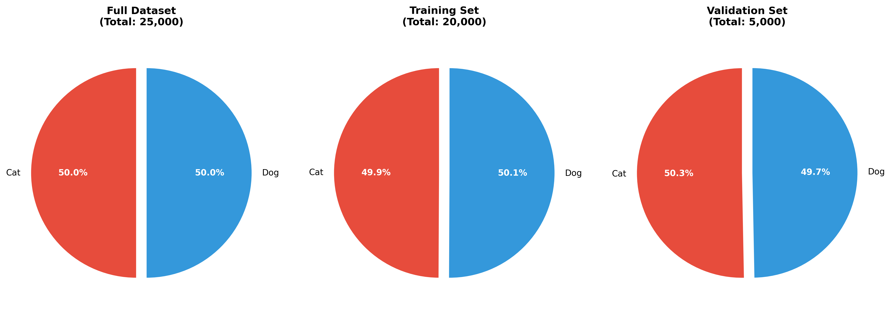

# Dog vs Cat Image Classification
Dogs 🐶 vs Cats 🐱 classification using deep learning models, trained on RTX 2080 Ti and Google Colab (T4).  
Dataset Used : [Dogs vs. Cats](https://www.kaggle.com/competitions/dogs-vs-cats/data)

## Project Structure
```
DogCatClassifier
 ┣ data/             # Data-related files
 ┃ ┣ data/           # Dataset folder (not included)
 ┃ ┗ dataloader.py   # Custom data loading scripts
 ┣ models/
 ┃ ┗ model.py        # Model architecture definition
 ┣ result/           # Training results, confusion matrix images, etc.
 ┣ main.py           # Training and validation entry point
 ┣ config.py         # Configuration file (hyperparameters, paths)
 ┣ train.py          # training code
 ┣ evaluate.py       # Model evaluation script
 ┣ predict.py        # predict and save as csv file
 ┣ data_analysis.py  # Dataset statistics and analysis
 ┣ requirements.txt  # Required Python packages
 ┗ README.md         # Project description
```

## Datasets
- The dataset is from the official Kaggle Dogs vs. Cats competition, containing about 25,000 images evenly split between dogs and cats.
- Images have variable sizes; resizing and data augmentation are applied during training.
- Please download the dataset from Kaggle and place it under `data/data/`.
- The original training set is randomly split into training and validation subsets with an 80:20 ratio.
- The validation subset is used to evaluate model performance during training and after.
- Data preprocessing includes resizing, normalization, and data augmentation(horizontal flip, Mixup) on the training subset.
- The distribution of classes in the training and validation sets is shown below:



## Environment Setup & Requirements
It is recommended to use Python 3.10+ and set up a virtual environment before installing dependencies:
```bash
# Create and activate virtual environment
python3 -m venv venv
source venv/bin/activate
# Install PyTorch (adjust for your CUDA version if needed)
pip install torch torchvision torchaudio --index-url https://download.pytorch.org/whl/cu121

# Install other required packages
pip install -r requirements.txt
```

## Training and Evaluation
- Training the model
```bash
python main.py --model_name {model_name} --use_mixup {True/False}
# For example
python main.py --model_name resnet18 --use_mixup True
```
*model_name can choose resnet18, resnet50, efficientnet_b0, densenet121, vit_b_16

- Evaluate the model
```bash
python evaluate.py --data_dir {data_dir} --best_model_path {best_model_path}
# For example
python evaluate.py --data_dir data/data --best_model_path result/best_model.pth
```

- Predicting images and save as csv file
```bash
python predict.py --best_model_path {best_model_path} --save_file {save_file}
# For example
python predict.py --best_model_path result/best_model.pth --save_file "prediction.csv"
```

## Model Details
- Backbone: Pretrained ResNet18 fine-tuned for binary classification
- Loss function: CrossEntropyLoss
- Optimizer: Adam
- Data augmentation: random horizontal flip, Mixup
- Training conducted on RTX 2080 Ti and Google Colab T4 GPUs

## Results
The reported accuracy and metrics are based on the validation set (20% of the original training data), **not on a separate test set**.
- 
### Model Performance Comparison

We evaluated multiple deep learning architectures on our dataset to identify the best performing model. All models were trained with consistent hyperparameters and evaluated using the same set.
#### Baseline Model Performance
  
| Model           | Batch Size | Accuracy | Precision | Recall | F1-Score* |
|-----------------|------------|----------|-----------|--------|-----------|
| ResNet-18       | 128        | 98.30%   | 98.75%    | 97.84% | 98.29%    |
| ResNet-50       | 128        | 99.04%   | 98.53%    | 99.56% | 99.04%    |
| EfficientNet-B0 | 128        | **99.06%**   | 98.65%    | 99.46% | 99.05%    |
| DenseNet-121    | 64         | **99.14%** | **99.32%** | 98.96% | **99.14%** |
| ViT-B/16        | 64         | 98.00%   | 98.41%    | 97.53% | 97.97%    |
| ViT-B/16        | 32         | 95.68%   | 99.13%    | 92.07% | 95.46%    |

*F1-Score calculated as harmonic mean of Precision and Recall

### Data Augmentation Impact

To improve model robustness and reduce overfitting, we applied various data augmentation techniques to ResNet-18 as our baseline model.

#### Augmentation Techniques Evaluated

| Augmentation Strategy | Accuracy | Precision | Recall | F1-Score | Improvement |
|----------------------|----------|-----------|--------|----------|-------------|
| Original (No Aug.)   | 98.30%   | 98.75%    | 97.84% | 98.29%   | Baseline    |
| + Horizontal Flip    | 98.92%   | 98.71%    | 99.11% | 98.91%   | +0.62%      |
| + MixUp             | 98.94%   | 98.76%    | 99.12% | 98.94%   | +0.64%      |
| + Both Techniques   | **99.14%** | **99.40%** | **98.88%** | **99.14%** | **+0.84%** |

### Visual Results

The following figures provide additional insights into model performance:

<!-- - **Confusion Matrix**: `figures/confusion_matrix.png` - Shows detailed classification performance breakdown


- **ROC Curve**: `figures/roc_curve.png` - Illustrates the trade-off between true positive and false positive rates
 -->


| **Confusion Matrix** | **ROC Curve** |
|----------------------|---------------|
| Shows detailed classification performance breakdown | Illustrates the trade-off between true positive and false positive rates |
|  |  |